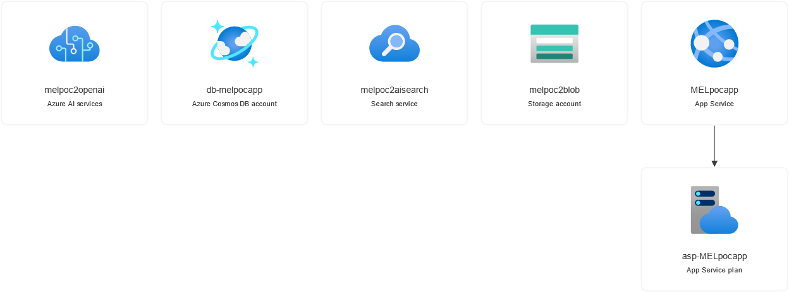

# Resource Deployment

Launching a ChatBot using Azure OpenAI Service involved two primary steps:

- Registering for access to the OpenAI service and creating an Azure "service resource". [Microsoft instructions for this here](https://learn.microsoft.com/en-us/azure/ai-services/openai/how-to/create-resource?pivots=web-portal). 
- Creating the Chatbot (or other AI service). We've done this using "OpenAI studio." [Microsoft instructions for this here](https://learn.microsoft.com/en-us/azure/ai-services/openai/use-your-data-quickstart?tabs=command-line&pivots=programming-language-studio)

In our experience each of these steps requires understanding somewhat esoteric settings, parameters, or other resources that needed to be deployed in a [Resource Group](https://learn.microsoft.com/en-us/azure/azure-resource-manager/management/manage-resource-groups-portal#what-is-a-resource-group). We have done our best to capture this information here with relevant documention. We used the steps in the links above as our starting point but ultimately had to experiment and go through a lot of other documentation to arrive at the settings listed below.

 We also found [this tutorial from the Microsoft Educator Developer Blog](https://techcommunity.microsoft.com/t5/educator-developer-blog/bring-your-own-data-to-azure-openai-step-by-step-guide/ba-p/3905212) to be extremely helpful and would recommend starting with it and referncing our notes below.  

## Technical Architecture
Create a resource group inside the Azure Platform. Inside this resource group you will create 3 resources
- a storage account resource, 
- a cognitive search service, 
- and an Azure OpenAI service. 

Inside Azure OpenAI service youI'll create the deployment, test it in the chat playground, and deploy it to a web app. We chose `gpt-3.5-turbo` for our deployment because it had fewer latency issues and was somewhat less expensive than more recent versions (e.g. gpt4) but this has likely changed.

### Resource Group Parameters
- Subscription: `Name_it` (our organizaiton has a variety of subscriptions to for internal chargeback and billing: check with your Azure admin to understand which subscription should be used)
- Resource Group: `MEL_poc` (choose a descriptive name: this was a proof of concept for MEL documents)
- Region: `(US) East US 2` (You'll want to consider which region to use. Some models or services are only available in some regions. Best practice is to deploy all resources in the same region.)

### Storage Account Parameters
**Basics Tab**
- Subscription: `Name_it`
- Resource Group: `MEL_poc`
- Storage Account Name: `melpocblob` (this is the account that will hold the documents)
- Region: `(US) East US 2`
- Performance: `standard`
- Redundancy: leave defaults including making read access to data.

**Advanced Tab**
- Left all defaults

**Network Tab**
- Left all defaults, including "Enable Public Access from all Networks" under connectivity. 

**Data Protection, Encryption, Tags tabs**
- Left all defaults

### AI Cognitive Search
**Basics Tab**
- Subscription: `Name_it`
- Resource Group: `MEL_poc`
- Service Name: `melpocaisearch`(choose a descriptive name)
- Location: `(US) East US 2`

**Scale Tab**
- Replicas: I scaled this up to `3` as prompted by the service, which initiates a cost of $749.95 per month at the time of writing.
- Partitions: Leave defaults

**Network & Tags Tabs**
- Left all defaults, including "Endpoint connectivity data" as `Public`.

### Azure OpenAI Resource
- Subscription: `Name_it`
- Resource Group: `MEL_poc`
- Region: `(US) East US 2`
- Name: `melpocopenai`
- Pricing tier: `Standard S0` (this was the only option)

**Network Tabs**
- Left defaults: all networks can access this resource. 

### Create ChatGPT Deployment
To do this, go into the `MEL_poc` resource group and select the `melpocopenai` resource. Then select "Go to Azure OpenAI Studio". Once in the studio, click to create a deployment. 

**Deploy Model Pop Up Window**
- Select a model: `gpt-35-turbo-16k` (I'd previously identified this as the most cost and performance effective for document retrieval and summary)
- Model version: `0613` is the only version that supports using your own data at the time of writing. 
- Deployment type: `Standard` (no other options)
- Deployment name: Name: `melpocchatgpt35turbo16`
- Content filder: `Default` (no other options)
- Token per minute rate limit: `120k` (default)
- Enable Dynamic Quote: enabled (default)

### Bring Your Own Data
Inside your Deployments tab, select the previously created `melpocchatgpt35turbo16` deployment followed by selecting "Open in Playground" in the upper nav bar.

_Issues_: When prompted to select the blog storage account I created (`melpoc2blob`), I got the following warning: 
> No blob containers were found for this resource. Please select a resource with at least one container.
But I realized that I was trying to connect to a container and NOT uploading files, as the instructions suggest!

**File upload: data source**
- Select Data Source: Upload files
- Subscription: `Name_it`
- Select Azure Blob storage resource: `melpocblob`
    - Be sure to "Turn on CORS"
- Select Azure AI Search Resource: `melpocaisearch`
- Enter Index Name: `melpocsubsetindex` (this indicates I'm just indexing a small subset of files)

The next prompt is simply to drag/drop files and upload. 

**Data management**
- Search Type: `Keyword` 
- Chunk Size: `1024` (default)

When we ran this the files uploaded, preprocessed, and indexed in under a minute. 

## Deploy to a Website
In AI studio, I clicked to "Deploy to" a new web application.

- Name: `Name_of_app`
- Subscription: `Name_it`
- Resource group: `MEL_poc`
- Location: `East US 2`
- Pricing Plan: `Free (F1)`
    - I selected to enable chat history, which does incur charges!

Click on the purple button to launch the application and WAIT for it to load. This took some time for us.

You will then be prompted to accept permissions to:
- Maintain access to data you have given it access to
- Sign you in and read your profile
- Consent on behalf of your organization
- The chatbot should go live and automatically require an organizational email and password to access. The URL configuration was https://name_of_app.azurewebsites.net/. 

## Chatbot Parameters
In AI studio, we set the following parameters:

### Configuration > Deployment
Session settings left at 10 (default)

### Configuration > Parameters
Max response (tokens): `800` (Default). 
- Set a limit on the number of tokens per model response. The API supports a maximum of 4000 tokens shared between the prompt (including system message, examples, message history, and user query) and the model's response. One token is roughly four characters for typical English text.

Temperature: `0.20`
- Controls randomness. Lowering the temperature means that the model produces more repetitive and deterministic responses. Increasing the temperature results in more unexpected or creative responses. Try adjusting temperature or Top P but not both. 

Top P (aka top probabilities): `1` (default)
- Similar to temperature, this controls randomness but uses a different method. Lowering Top P narrows the model’s token selection to likelier tokens. Increasing Top P lets the model choose from tokens with both high and low likelihood. Try adjusting temperature or Top P but not both.

Stop sequences: left blank (default)
- Make responses stop at a desired point, such as the end of a sentence or list. Specify up to four sequences where the model will stop generating further tokens in a response. The returned text won't contain the stop sequence.

Frequency penalty: left blank (default)
- Reduce the chance of repeating a token proportionally based on how often it has appeared in the text so far. This decreases the likelihood of repeating the exact same text in a response.

Presence penalty: left blank (default)
- Reduce the chance of repeating any token that has appeared in the text at all so far. This increases the likelihood of introducing new topics in a response.

### Setup and Prompts
Interesting to note that with data added, the "few shot examples" are not used. I guess because it's grounded? 

## Final Architecture
Using the visualizer in Azure, we found that our resources were configured in the following way: 

## Evaluation
Following the deployment of the proof of concept, a member of the MEL team with significant LLM experience further tested and refined the PoC. 

### Testing for Accuracy
To set a benchmark for the performance of the model we made a questionnaire with 50 questions based on some of the documents used for the prototype. With the current configuration we received 46 correct answers. In 1 case the model stated it could not answer the question and in other 3 cases model used the wrong documents to find the answer. It is important to state that the questions were aimed on facts retrieval and clearly specified from which report the information should come (without explicitly mentioning file name).

## Parameter tunning
### Temparature
Controls randomness. Lowering the temperature means that the model will produce more repetitive and deterministic responses. Increasing the temperature will result in more unexpected or creative responses. To see what impact temperature had on the answers we took subset of the questions from the previous questions and ran them through the models with different temperature settings: (0, 0.2, 0.4, 0.6, 0.8, 1). We obsereved that changing temperature had no impact on correctness of the answers and only a slight impact on the wording of the answer. These results are explained by the fact that we are asking questions that focus on finding facts, which is dependent on the cognitive search and not the ChatGPT model. In conclusion, for the use cases where the finding facts in the documents is a focus,  temperature does not play major role. If the temperature is low the answer will look like a direct quote from the document, and if temperature is high - the model will rephrase the answer.

### Top P
Similar to temperature, this controls randomness but uses a different method. Lowering Top P will narrow the model’s token selection to likelier tokens. Increasing Top P will let the model choose from tokens with both high and low likelihood. We conducted the same experiment as with temperature, but this time fixing temperature and changing Top P. The results are very similar to temperature experiment - changing Top P had no impact on correctness of the answer, and only impacted the wording for the answer.

Based on the experiments and [Microsoft recomendations](https://learn.microsoft.com/en-us/azure/ai-services/openai/how-to/completions), temperature and Top P settings do not control "cleverness" or "creativity" in the model response. Low temperature will provide a nearly direct quote from the document, which is desirable result for the cases when the chatbot is primarily used for finding required data in the documents. For the cases where the chatbot is used for interpreting and analyzing data, using higher settings is advisable.

## Keyword vs Semantic Search
In the scope of the PoC we wanted to compare perforamnce of keyword search and semantic search. Keyword search matches exact terms in the query to the documents, focusing on precise keyword matching and traditional IR metrics for ranking. Semantic search, on the other hand, uses natural language processing and machine learning to understand the context and intent behind the query, providing more relevant results based on the meaning rather than just the exact words. While keyword search is faster and suited for precise queries, semantic search should be able to handle complex queries by understanding the overall context and relationships between words.

To use semantic search we needed to vectorize data when creating and index in cognitive search. We did this using OpenAI services and their text embbeding models. We decided to use `text-embedding-3-large` because [Microsoft documentation](https://learn.microsoft.com/en-us/azure/ai-services/openai/concepts/models) suggests it is the most capable embedding model. Using embedding models will add additional cost, the cost depends on the usage of the model. The price for `text-embedding-3-large` is $0.00013 per 1000 tokens. We estimate that it will cost $109 to vectorize the approximately 300 documents used for this project.

### Set up Keyword Index
Inside Azure Cognitive search (`melpocaisearch`) click import data, in the following menu in Data Source dropdown list choose Azure Blob storage; give the data source meaningful name; in Data to extract choose Content and metadata; Chose correct subscription; click “Choose an existing connection” and navigate to existing blob storage. 

You have the option to add cognitive skills to the index, such as extracting people’s names, extracting organization names, etc. These skills add additional costs but can improve performance. 
 
The following step is “Customize target index”. In our case, we didn't have additional metadata to use for search, so our index was be based on the content of documents. Also, don’t forget to name your index.
After this we can create an indexer, that we will be able to add to the chat bot as data source.

### Set up Semantic Search Index
Setting up Semantic Search Index is very similar to Keyword Index.  Click on “Import and vectorize data”; In the following menu navigate to Blob Storage with the documents; In “Vectorize your text” step choose the text embedding model that we deployed before; Then we can also vectorize images, but this is outside of the scope of project; Also do not change anything in Advanced settings; After this, review and create the index, note that it will take some time vectorize all documents (around 1 hour).

After this, you will have two indexes that can used used by chatbots:
- keyword search index
- semantic search index